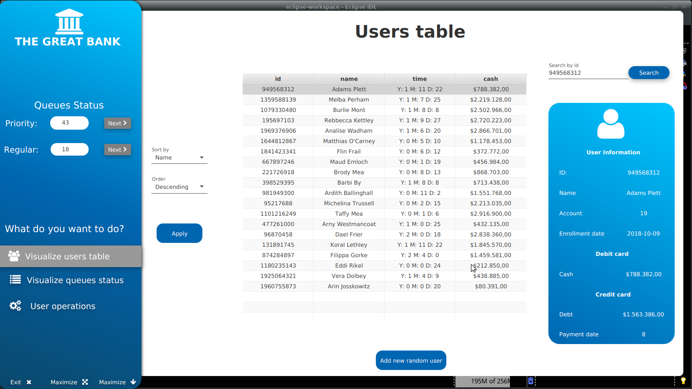

# Bank Queue Manager 

## Problem Identification
A big bank wants to develop a software that models the functioning of one of its headquarters with the highest flow of people.
The program should be able to:
- Store users associated with the bank and not associated.
- Manage a row for normal users and another for priority users.
- Allow the user to carry out withdrawal / deposit actions, account cancellation and card payment.
- Undo the last actions performed by users.
- View the queue of normal users and the first one in the priority queue.
- View the user's information when serving it.
- View the list of bank clients.
- Sort the list of users present in the bank, according to 4 different criteria (Id, Name, Date, Cash).

App Demo: 

## Documentation
[Documentation can be found here](https://drive.google.com/file/d/1XkH7qd8txhinFQeQJIvqWEo_jHGla2UH/view?usp=sharing "Documentation")

## Changes 

- All phases of engineering method report

In the Google Docs document there exists a version called "Milestone 2" which contains the new changes done and can be compared with the older version of the documentation